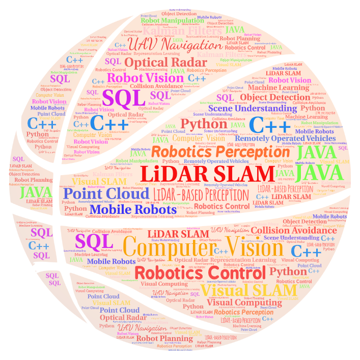

Robotic systems and 3D Vision 
Principal Investigator (PI), PhD Supervisor, Junior Professor  
Senior Researcher and Senior Engineer, [Caltech](https://www.caltech.edu/), [Nanyang Technological University.](https://www.ntu.edu.sg/), [The Chinese University of Hong Kong.](https://www.cuhk.edu.hk/english/index.html) 
Doctor of Philosophy, [The Chinese University of Hong Kong.](https://www.cuhk.edu.hk/english/index.html)  

<!-- The Chinese University of Hong Kong, Hong Kong SAR, China HKUST and Assistant Professor Associate Scientist, Senior Robotics Engineer Research Fellow Robotics -->  

<!-- The starting date can be spring 2024 or Fall 2024. Dr. Liu is a Senior Robotics Engineer and Research Fellow, -->

**Research Interests**
=======
Kangcheng Liu's research interests lie within the intersection of robotic systems and 3D vision. 

He specialized in Robotics and Automation, Robotics Localization and Mapping, Vision/LiDAR-based Localization, Representation Learning, Computer Graphics, Data-efficient Learning, 3D Deep Learning, UAV/UGV Navigation, Medical Imaging, Multi-axis Robot 3D Printing, Robot Machining, and Onboard Robotics Scene Understanding. 

**Short Introduction**
=======

Prof. Kangcheng Liu's first-authored works in terms of 3D computer vision and robotics are widely published in international TOP flagship conferences and journals. His first-authored works has won many best paper awards in TOP venues, and was published and recognized as best paper candidates widely among TOP journals such as TPAMI, IJCV and ACM TOG. <!-- He has ten first-author publications in TOP-tier Computer Vision and Robotics Journals and Conferences, and has 20+ publications in core international journals and conferences indexed by SCI/EI. -->
 <!-- He serves as the associate editor of selected [IEEE International Conference on Robotics and Automation (ICRA)](https://ieeexplore.ieee.org/xpl/conhome/1000639/all-proceedings). July in 2022 Kangcheng Liu  -->  

In terms of his service, he has been nominated to be the program commitee member of the international flagship conferences: [IEEE International Conference on Robotics and Automation (ICRA)](https://ieeexplore.ieee.org/xpl/conhome/1000639/all-proceedings), [IEEE International Conference on Pattern Recognition (ICPR)](https://ieeexplore.ieee.org/xpl/conhome/1000545/all-proceedings), [IEEE International Conference on Automation Science and Engineering (CASE)](https://ieeexplore.ieee.org/xpl/conhome/1001095/all-proceedings), [IEEE International Conference on Image Processing (ICIP)](https://ieeexplore.ieee.org/xpl/conhome/1000349/all-proceedings), [ICARM](https://ieeexplore.ieee.org/xpl/conhome/1815004/all-proceedings) and [IROS](https://ieeexplore.ieee.org/xpl/conhome/1000393/all-proceedings). He has also been nominated to be the program session chair of international flagship conferences such as [ICRA](https://ieeexplore.ieee.org/xpl/conhome/1000639/all-proceedings), [IROS](https://ieeexplore.ieee.org/xpl/conhome/1000393/all-proceedings), [IEEE-SMC](https://ieeexplore.ieee.org/xpl/conhome/1000738/all-proceedings), [ICIP](https://2023.ieeeicip.org/), [ICARM](https://ieeexplore.ieee.org/xpl/conhome/1815004/all-proceedings), [CYBER](https://ieeexplore.ieee.org/xpl/conhome/1800486/all-proceedings), and [ICCA](https://ieeexplore.ieee.org/xpl/conhome/1000167/all-proceedings). He also serves as the program commitee member or the reviewers of more than 50 kinds of international conferences such as [CVPR](https://cvpr2023.thecvf.com/), [ICCV](https://openaccess.thecvf.com/ICCV2021), [ECCV](https://link.springer.com/conference/eccv), [ACM SIGGRAPH](https://s2023.siggraph.org/), [CoRL](https://www.corl2023.org/), and more than 20 kinds of international TOP journals such as [IJCV](https://www.springer.com/journal/11263), [T-PAMI](https://ieeexplore.ieee.org/xpl/RecentIssue.jsp?punumber=34), [IJRR](https://journals.sagepub.com/home/ijr), [T-RO](https://ieeexplore.ieee.org/xpl/RecentIssue.jsp?punumber=8860), [JFR](https://onlinelibrary.wiley.com/journal/15564967), [AIJ](https://www.sciencedirect.com/journal/artificial-intelligence), and [T-CYB](https://ieeexplore.ieee.org/xpl/RecentIssue.jsp?punumber=6221036).

He received his Ph.D. degree from [The Chinese University of Hong Kong](https://www.cuhk.edu.hk/english/index.html) (CUHK) with honors. He obtained the B.Eng degree at the [Department of Electrical Engineering and Automation](http://hitee.hit.edu.cn/) [Harbin Institute of Technology](http://www.hit.edu.cn/) with honors, and with a minor in mechatronic engineering. He was selected as the HKPFS awardee (TOP 162 at Hong Kong in 2018) during his PhD, and he was also elected as the TOP-20 annual outstanding graduate of HIT.

<!-- In terms of his service, he has been nominated to serve as the program commitee member of the international flagship conferences: [IEEE International Conference on Robotics and Automation (ICRA)](https://ieeexplore.ieee.org/xpl/conhome/1000639/all-proceedings) and [IEEE International Conference on Pattern Recognition (ICPR)](https://ieeexplore.ieee.org/xpl/conhome/1000545/all-proceedings) and [IEEE International Conference on Automation Science and Engineering (CASE)](https://ieeexplore.ieee.org/xpl/conhome/1001095/all-proceedings) and [IEEE International Conference on Image Processing (ICIP)](https://ieeexplore.ieee.org/xpl/conhome/1000349/all-proceedings), and [ICARM](https://ieeexplore.ieee.org/xpl/conhome/1815004/all-proceedings). He has also been nominated to be the program session chair of international flagship conferences such as [ICRA](https://ieeexplore.ieee.org/xpl/conhome/1000639/all-proceedings), [IROS](https://ieeexplore.ieee.org/xpl/conhome/1000393/all-proceedings), [IEEE-SMC](https://ieeexplore.ieee.org/xpl/conhome/1000738/all-proceedings), [ICIP](https://2023.ieeeicip.org/), [ICARM](https://ieeexplore.ieee.org/xpl/conhome/1815004/all-proceedings), [CYBER](https://ieeexplore.ieee.org/xpl/conhome/1800486/all-proceedings), and [ICCA](https://ieeexplore.ieee.org/xpl/conhome/1000167/all-proceedings). He also serves as the program commitee member or the reviewers of more than 20 kinds of international conferences such as [CVPR](https://cvpr2023.thecvf.com/), [ICCV](https://openaccess.thecvf.com/ICCV2021), [ECCV](https://link.springer.com/conference/eccv), [ACM SIGGRAPH](https://s2023.siggraph.org/), [CoRL](https://www.corl2023.org/), and more than 10 kinds of international TOP journals such as [IJCV](https://www.springer.com/journal/11263), [T-PAMI](https://ieeexplore.ieee.org/xpl/RecentIssue.jsp?punumber=34), [IJRR](https://journals.sagepub.com/home/ijr), [T-RO](https://ieeexplore.ieee.org/xpl/RecentIssue.jsp?punumber=8860), [JFR](https://onlinelibrary.wiley.com/journal/15564967), [AIJ](https://www.sciencedirect.com/journal/artificial-intelligence), and [T-CYB](https://ieeexplore.ieee.org/xpl/RecentIssue.jsp?punumber=6221036). -->

<!-- In terms of his service, he has been nominated to be the program commitee member and the program session chair of international flagship conferences such as [ICRA](https://ieeexplore.ieee.org/xpl/conhome/1000639/all-proceedings), [IROS](https://ieeexplore.ieee.org/xpl/conhome/1000393/all-proceedings), [IEEE-SMC](https://ieeexplore.ieee.org/xpl/conhome/1000738/all-proceedings), [ICIP](https://2023.ieeeicip.org/), [ICARM](https://ieeexplore.ieee.org/xpl/conhome/1815004/all-proceedings), [CYBER](https://ieeexplore.ieee.org/xpl/conhome/1800486/all-proceedings), and [ICCA](https://ieeexplore.ieee.org/xpl/conhome/1000167/all-proceedings). He also serves as the reviewers of more than 20 kinds of international conferences such as [CVPR](https://cvpr2023.thecvf.com/), [ECCV](https://link.springer.com/conference/eccv), [ACM SIGGRAPH](https://s2023.siggraph.org/), and more than 10 kinds of international journals such as [IJCV](https://www.springer.com/journal/11263), [T-PAMI](https://ieeexplore.ieee.org/xpl/RecentIssue.jsp?punumber=34), [T-RO](https://ieeexplore.ieee.org/xpl/RecentIssue.jsp?punumber=8860), [JFR](https://onlinelibrary.wiley.com/journal/15564967), [AIJ](https://www.sciencedirect.com/journal/artificial-intelligence), and [T-CYB](https://ieeexplore.ieee.org/xpl/RecentIssue.jsp?punumber=6221036). by the [IEEE Robotics and Automation Society (IEEE RAS)](http://www.ieee-ras.org/) --> 

<!-- He serves as the associate editor of [IEEE International Conference on Robotics and Automation (ICRA)](https://ieeexplore.ieee.org/xpl/conhome/1000639/all-proceedings). -->

You can find his developed open-sourced project on his [Github Project Page](https://github.com/KangchengLiu).

Selected Representative Publications
======

**Kangcheng Liu**. [ RM3D: Robust Data-Efficient 3D Scene Parsing via Traditional and Learnt 3D Descriptors-based Semantic Region Merging.](https://link.springer.com/article/10.1007/s11263-022-01740-3) [International Journal of Computer Vision (IJCV)](https://www.springer.com/journal/11263), 2022, IF in 2022: 19.5, Pages 1-30.
    
    <a href="https://github.com/KangchengLiu/RM3D">Codes</a>

**Kangcheng Liu**, Cao Muqing.  [ DLC-SLAM: A Robust LiDAR-SLAM System with Learning-based Denoising and Loop Closure. ](https://ieeexplore.ieee.org/document/10092189)  [IEEE Transactions on Mechatronics (T-MECH)](https://ieeexplore.ieee.org/document/10092189), March 2023. 
    
    <a href="https://github.com/KangchengLiu/DLC_LiDAR_SLAM">Systematic Codebase of DLC-LiDAR-SLAM_v1.6.</a>    
    
    <a href="https://github.com/KangchengLiu/slam_resources">Preliminary Codebase of LiDAR-SLAM_v1.2.</a>

**Kangcheng Liu**, Shao Ling.  [ FAC: 3D Representation Learning via Foreground Aware Feature Contrast. ](https://openaccess.thecvf.com/content/CVPR2023/papers/Liu_FAC_3D_Representation_Learning_via_Foreground_Aware_Feature_Contrast_CVPR_2023_paper.pdf)  [CVPR 2023](https://cvpr2023.thecvf.com/).  
    
    <a href="https://github.com/KangchengLiu/FAC_Foreground_Aware_Contrast"> Codes of this work and the compared works.</a>    

**Kangcheng Liu**, et al.  [ Generalized Label-Efficient 3D Scene Parsing via Hierarchical Feature Aligned Pre-Training and Region-Aware Fine-tuning. ](https://arxiv.org/abs/2312.00663). 
    
    <a href="https://drive.google.com/drive/folders/1M58V-PtR8DBEwD296zJkNg_m2qq-MTAP"> Codes</a>    

**Kangcheng Liu**, Zhi Gao, Feng Lin, and Ben M. Chen.  [FG-Net: A Fast and Accurate Framework for Large-Scale LiDAR Point Clouds Understanding. ](https://ieeexplore.ieee.org/abstract/document/9756643/)   [IEEE Transactions on Cybernetics (T-CYB)](https://ieeexplore.ieee.org/xpl/RecentIssue.jsp?punumber=6221036), March 2022, IF in 2021: 19.118. 
    
    <a href="https://ieeexplore.ieee.org/abstract/document/9756643">IEEE Xplore </a> 
    
    <a href="https://github.com/KangchengLiu/Feature-Geometric-Net-FG-Net">Codes</a>

**Kangcheng Liu** and Ben M. Chen. [ Industrial UAV-based Unsupervised Domain Adaptive Crack Recognitions: From System Setups to Real-Site Infrastructural Inspections. ](https://ieeexplore.ieee.org/abstract/document/9900135) [IEEE Transactions on Industrial Electronics (TIE),](https://ieeexplore.ieee.org/xpl/RecentIssue.jsp?punumber=41) 2022, , IF in 2021: 8.162.   
    
    <a href="https://ieeexplore.ieee.org/abstract/document/9900135"> IEEE Xplore </a> 
    
    <a href="https://github.com/KangchengLiu/Crack-Detection-and-Segmentation-Dataset-for-UAV-Inspection">Codes and Datasets.</a>

**Kangcheng Liu**, et al.  [ Generalized 3D Self-supervised Learning Framework via Prompted Foreground-Aware Feature Contrast. ](https://arxiv.org/abs/2303.06388) 
[International Journal of Computer Vision (IJCV)](https://www.springer.com/journal/11263), 2022, IF in 2022: 19.5, Pages 1-30.
    
    <a href="https://github.com/KangchengLiu/RM3D">Codes</a> 

**Kangcheng Liu**. [ Online Robot Navigation and Manipulation with Distilled Vision-Language Models.](https://arxiv.org/abs/2401.17083v4) [IEEE International Conference on Robotics and Automation (ICRA),](https://ieeexplore.ieee.org/xpl/conhome/1000639/all-proceedings).
    
    <a href="https://github.com/KangchengLiu/DLC_LiDAR_SLAM">Codes</a>

**Kangcheng Liu**, Aoran Xiao, and Shijian Lu. [  D-LC-Nets: Robust Denoising and Loop Closing Networks for LiDAR-SLAM in Complicated Circumstances with Noisy Point Clouds. ](https://ieeexplore.ieee.org/document/9981388) [2022 IEEE/RSJ International Conference on Intelligent Robots and Systems (IROS).](https://ieeexplore.ieee.org/xpl/conhome/1000393/all-proceedings)  (Oral)       
    <a href="https://ieeexplore.ieee.org/abstract/document/9900135"> IEEE Xplore </a> 
    
    <a href="https://github.com/KangchengLiu/DLC_LiDAR_SLAM">Systematic Codebase of DLC-LiDAR-SLAM_v1.6.</a>    
    
    <a href="https://github.com/KangchengLiu/slam_resources">Preliminary Codebase of LiDAR-SLAM_v1.2.</a>

**Kangcheng Liu**, Zhi Gao, Feng Lin, and Ben M. Chen.  [Fast Large-Scale LiDAR Point Clouds Understanding Network Leveraging Correlated Feature Mining and Geometric-Aware Modelling. ](https://arxiv.org/abs/2012.09439)   [IEEE Transactions on Cybernetics (T-CYB)](https://ieeexplore.ieee.org/xpl/RecentIssue.jsp?punumber=6221036), December 2020, IF in 2021: 19.118. 
    
    <a href="https://ieeexplore.ieee.org/abstract/document/9756643">IEEE Xplore </a> 
    
    <a href="https://github.com/KangchengLiu/Feature-Geometric-Net-FG-Net">Codes</a>

<!-- **Kangcheng Liu**. [ A Robust and Effective LiDAR-SLAM System with Learning-based Denoising and Loop Closure. ] [IEEE Transactions on Mechatronics (T-MECH)](https://ieeexplore.ieee.org/xpl/RecentIssue.jsp?punumber=3516)， IF in 2021: 5.867. (FG-Net_v1)
    
    <a href="https://github.com/KangchengLiu/DLC_LiDAR_SLAM">Systematic Codebase of DLC-LiDAR-SLAM_v1.6.</a>    
    
    <a href="https://github.com/KangchengLiu/slam_resources">Preliminary Codebase of LiDAR-SLAM_v1.2.</a> -->

**Kangcheng Liu**, Zhi Gao, Feng Lin, and Ben M. Chen.  [FG-Conv: Large-Scale LiDAR Point Clouds Understanding Leveraging Feature Correlation Mining and Geometric-Aware Modeling. ](https://ieeexplore.ieee.org/abstract/document/9561496) [IEEE International Conference on Robotics and Automation (ICRA), 2021](https://ieeexplore.ieee.org/xpl/conhome/1000639/all-proceedings).  (Oral) .
    
    <a href="https://ieeexplore.ieee.org/abstract/document/9561496">IEEE Xplore </a> 
    
    <a href="https://github.com/KangchengLiu/Feature-Geometric-Net-FG-Net">Codes</a>

**Kangcheng Liu**, Yuzhi Zhao, and Ben M. Chen.  [WeakLabel3D-Net: A Complete Framework for Real-Scene LiDAR Point Clouds Weakly Supervised Multi-Tasks Understanding. ](https://ieeexplore.ieee.org/abstract/document/9811959) [IEEE International Conference on Robotics and Automation (ICRA), 2022](https://ieeexplore.ieee.org/xpl/conhome/1000639/all-proceedings).  (Oral) .
    
    <a href="https://ieeexplore.ieee.org/abstract/document/9811959"> IEEE Xplore </a> 
    
    <a href="https://github.com/KangchengLiu/RM3D">Codes</a>

**Kangcheng Liu**, Yuzhi Zhao, Qiang Nie, and Ben M. Chen. [ Weakly Supervised 3D Scene Parsing with Region-Level Boundary Awareness and Instance Discrimination.](https://link.springer.com/chapter/10.1007/978-3-031-19815-1_3) [European Conference on Computer Vision (ECCV) 2022.](https://link.springer.com/conference/eccv)   
    
    <a href="https://link.springer.com/chapter/10.1007/978-3-031-19815-1_3"> ECCV Springer Book </a> 
    
    <a href="https://www.ecva.net/papers/eccv_2022/papers_ECCV/papers/136880036.pdf"> PDF </a> 
    
    <a href="https://github.com/KangchengLiu/Weakly-Supervised-3D">Codes</a>

**Kangcheng Liu**. [ Robust Industrial UAV/UGV-Based Unsupervised Domain Adaptive Crack Recognitions with Depth and Edge Awareness: From System and Database Constructions to Real-Site Inspections. ](https://dl.acm.org/doi/abs/10.1145/3503161.3548304) [ACM International Conference on Multimedia (ACM MM) 2022.](https://dl.acm.org/conference/mm)  (Oral). 
    
    <a href="https://dl.acm.org/doi/abs/10.1145/3503161.3548304"> ACM Digital Library </a> 
    
    <a href="https://github.com/KangchengLiu/Crack-Detection-and-Segmentation-Dataset-for-UAV-Inspection">Codes and Datasets</a>

**Kangcheng Liu**, Yanbin Qu, Hak-Man Kim, and Huihui Song. [ Avoiding frequency second dip in power unreserved control during wind power rotational speed recovery.](https://ieeexplore.ieee.org/abstract/document/8064700)  [IEEE Transactions on Power Systems (TPS),](https://ieeexplore.ieee.org/xpl/RecentIssue.jsp?punumber=59) May 2018, IF in 2021: 7.326.  (TPS highly cited paper in the topic of control for power systems.) .      
    <a href="https://ieeexplore.ieee.org/document/8064700">IEEE Xplore</a> 
    
    <a href="https://github.com/KangchengLiu/Wind_Turbine_Control_Code">Codes</a>

**Kangcheng Liu**, [ A LiDAR-Inertial-Visual SLAM System with Loop Detection ](https://arxiv.org/abs/2301.05604). Robotics: Science and Systems (RSS), Workshops, 2021  (Oral) . 

**Kangcheng Liu**, [ Learning-Based Defect Recognitions for Autonomous UAV Inspections ](https://arxiv.org/abs/2302.06093). Robotics: Science and Systems (RSS), Workshops, 2020  (Oral) . 

**Kangcheng Liu**, [ An Enhanced LiDAR-Inertial SLAM System for Robotics Localization and Mapping ](https://arxiv.org/abs/2212.14209). International Conference on Robotics and Automation (ICRA), Workshops, 2019  (Oral) . 

**Kangcheng Liu**, [ A Light-Weight LiDAR-Inertial SLAM System with Loop Closing ](https://arxiv.org/abs/2212.05743). International Conference on Robotics and Automation (ICRA), Workshops, 2020  (Oral) . 

**Kangcheng Liu**, Xiaodong Han, and Ben M. Chen. [ Deep Learning Based Automatic Crack Detection and Segmentation for Unmanned Aerial Vehicle Inspections. ](https://ieeexplore.ieee.org/document/8961534) [2019 IEEE International Conference on Robotics and Biomimetics (ROBIO),](https://ieeexplore.ieee.org/xpl/conhome/1000856/all-proceedings)  (Oral) 
    
    <a href="https://ieeexplore.ieee.org/abstract/document/9900135"> IEEE Xplore </a> 
    
    <a href="https://github.com/KangchengLiu/Crack-Detection-and-Segmentation-Dataset-for-UAV-Inspection">Codes and Datasets.</a>

  

**Kangcheng Liu**, [ Semi-Supervised Confidence-Level-based Contrastive Discrimination for Class Imbalanced Semantic Segmentation ](https://ieeexplore.ieee.org/abstract/document/9907146). 2022 IEEE International Conference on CYBER Technology in Automation, Control, and Intelligent Systems (CYBER), 2022. 

    <a href="https://ieeexplore.ieee.org/abstract/document/9907146"> IEEE Xplore </a> 
    
    <a href="https://mycuhk-my.sharepoint.com/:u:/g/personal/1155113950_link_cuhk_edu_hk/EbbjuIxVfn9ErFsO4dx5ChoBZIfBhoqfPvEpSoy6BL-fiA?e=Ng9tWo">Codes.</a>

**Kangcheng Liu**, [ A Robust and Efficient LiDAR-Inertial-Visual Fused Simultaneous Localization and Mapping System with Loop Closure ](https://ieeexplore.ieee.org/document/9907651). 2022 IEEE International Conference on CYBER Technology in Automation, Control, and Intelligent Systems (CYBER), 2022. 

    <a href="https://ieeexplore.ieee.org/abstract/document/9907651"> IEEE Xplore </a> 
    
    <a href="https://mycuhk-my.sharepoint.com/:u:/g/personal/1155113950_link_cuhk_edu_hk/EbbjuIxVfn9ErFsO4dx5ChoBZIfBhoqfPvEpSoy6BL-fiA?e=Ng9tWo">Codes.</a>

**Kangcheng Liu**, and Ben M. Chen. [ An Integrated Visual System for Unmanned Aerial Vehicles Following Ground Vehicles: Simulations and Experiments ](https://ieeexplore.ieee.org/document/9831831). 2022 International Conference on Control and Automation (ICCA), 2022  (Oral) . 
  
  <a href="https://ieeexplore.ieee.org/abstract/document/9831831"> IEEE Xplore </a> 
  
  <a href="https://mycuhk-my.sharepoint.com/:u:/g/personal/1155113950_link_cuhk_edu_hk/EbbjuIxVfn9ErFsO4dx5ChoBZIfBhoqfPvEpSoy6BL-fiA?e=Ng9tWo">Codes.</a>

  **Kangcheng Liu**, and Ben M. Chen. [ An Enhanced LiDAR Inertial Localization and Mapping System for Unmanned Ground Vehicles ](https://ieeexplore.ieee.org/document/9831822). 2022 International Conference on Control and Automation (ICCA), 2022  (Oral) .
  
  <a href="https://ieeexplore.ieee.org/abstract/document/9831822"> IEEE Xplore </a> 
  
  <a href="https://github.com/KangchengLiu/DLC_LiDAR_SLAM">Codes.</a>

**Kangcheng Liu**, [ A Light-Weight LiDAR-Inertial SLAM System with High Efficiency and Loop Closure Detection Capacity ](https://ieeexplore.ieee.org/document/9959555). 2022 IEEE International Conference on Advanced Robotics and Mechatronics (ICARM), 2022  (Oral) . 

    <a href="https://ieeexplore.ieee.org/document/9959555"> IEEE Xplore </a> 
    
    <a href="https://github.com/KangchengLiu/slam_resources">Codes of LiDAR-SLAM.</a>
        
    <a href="https://github.com/KangchengLiu/deep-learning-localization-mapping">Codes of Compared Works.</a>

<!-- **Recruitment**
=======
 Prof. Liu is recruiting and supervising Postdocs, PhD students, masters, and RAs with core research areas in robotics and automation, 3D vision, and manufacturing automation. Multiple positions are available but quota is competitive and limited. However, once offered, the salary will be highly competitive. Contact me if you are interested. Pls attach your CV and transcript in your application email.  
======= -->

Research Highlights
======

 

<!-- **Kangcheng Liu**, and Ben M. Chen.  An Integrated Visual System for Unmanned Aerial Vehicles Following Ground Vehicles: Simulations and Experiments. 2022 International Conference on Control and Automation (ICCA), 2022  (Oral) .
  
 **Kangcheng Liu**, and Ben M. Chen.  An Enhanced LiDAR Inertial Localization and Mapping System for Unmanned Ground Vehicles. 2022 International Conference on Control and Automation (ICCA), 2022  (Oral) .

**Kangcheng Liu**, **Guidong Yang**, and Ben M. Chen. Datasets and Methods for Boosting Infrastructure Inspection: A Survey on Defect Classification. 2022 International Conference on Control and Automation (ICCA), 2022.

**Kangcheng Liu**, **Guidong Yang**, and Ben M. Chen. Datasets and Methods for Boosting Infrastructure Inspection: A Survey on Defect Segmentation and Detection. 2022 International Conference on Control and Automation (ICCA), 2022.

Yuzhi Zhao, Lai-Man Po, **Kangcheng Liu**, Xuehui Wang, Win-Yin Yu.  SVCNet: Real-time Scribble-based Video Colorization with Pyramid Networks. Under Review of IEEE Transactions on Image Processing. 

Yuzhi Zhao, Lai-Man Po, Tingyu Lin, Xuehui Wang, **Kangcheng Liu**, et al.  Legacy Photo Editing with Learned Noise Prior. IEEE/CVF Winter Conference on Applications of Computer Vision (WACV),  (Oral) 
  
Jihan Zhang, Ruoyu Wang, Guidong Yang, **Kangcheng Liu**, et al. Sim-in-Real: Digital Twin Based UAV Inspection Process. 2022 International Conference on Unmanned Aircraft Systems (ICUAS), 2022.
  
**Kangcheng Liu**, D-LC-Nets: Robust Denoising and Loop Closing Networks for LiDAR-SLAM in Complicated Circumstances with Noisy Point Clouds. 2022 IEEE/RSJ International Conference on Intelligent Robots and Systems (IROS).  (Oral)  July 2018--> 
  
  
**AI Challenges and Competitions**
======

[Fully supervised 3D Semantic Segmentation on Paris-Lille-3D](https://kaldir.vc.in.tum.de/scannet_benchmark/data_efficient/), 3rd Place (2020.05)   

[Fully supervised 3D Semantic Segmentation on Semantic3D](https://kaldir.vc.in.tum.de/scannet_benchmark/data_efficient/), 6th Place (2020.08) (Reduced-8).    

[Fully supervised 3D Semantic Segmentation on ScanNet](https://kaldir.vc.in.tum.de/scannet_benchmark/data_efficient/), 6th Place (2020.09)  

[Fully supervised 3D Semantic Segmentation on S3DIS](https://kaldir.vc.in.tum.de/scannet_benchmark/data_efficient/), 2nd Place (2020.09)  

[Fully supervised 3D Semantic Segmentation on SensatUrban](https://kaldir.vc.in.tum.de/scannet_benchmark/data_efficient/), 5th Place (2021.02)  

[Weakly Supervised 3D Semantic Segmentation on ScanNet for the Limited Annotation Case](https://kaldir.vc.in.tum.de/scannet_benchmark/data_efficient/), 1st Place (2021.05)  

<!-- Weakly Supervised 3D Semantic Segmentation on ScanNet for the Limited Reconstruction Case,   1st Place (2021.08)   -->

[Weakly Supervised 3D Instance Segmentation on ScanNet for the Limited Annotation Case](https://kaldir.vc.in.tum.de/scannet_benchmark/data_efficient/), 1st Place (2021.08)  

<!--  Weakly Supervised 3D Instance Segmentation on ScanNet for the Limited Reconstruction Case, 1st Place (2021.08)   -->

[Weakly Supervised 3D Object Detection on ScanNet for the Limited Annotation Case](https://kaldir.vc.in.tum.de/scannet_benchmark/data_efficient/), 1st Place (2021.11)   

<!-- Weakly Supervised 3D Object Detection on ScanNet Benchmark the Limited Reconstruction Case, 1st Place (2021.11)    -->
The Hong Kong Regional Biggest Innovation and Entrepreneurship Competitions 2021, 3rd Prize  

The Hong Kong Regional Biggest Innovation and Entrepreneurship Competitions 2022, Merit Prize  

Awards
======

**Kangcheng Liu**, China National Robot Competition, Third Prize. 2017.

**Kangcheng Liu**, China National Mathematics Competition, First Prize. 2017.

**Kangcheng Liu**,  Hong Kong PhD Fellowship (HKPFS) Awardee. 2018.

**Kangcheng Liu**,  CUHK Vice-Chancellor Scholarship 2018.

**Kangcheng Liu**,  T-CYB Best Paper Finalist.

**Kangcheng Liu**, Professor Charles K. Kao Student Creativity Merit Award 2021.

**Kangcheng Liu**, Hong Kong Biggest Postgraduate Innovation and Entrepreneurship Competition 2021, Third Prize.

**Kangcheng Liu**, Hong Kong Biggest Postgraduate Innovation and Entrepreneurship Competition 2022, Merit Prize.

**Kangcheng Liu**, HIT Merit Student Pioneer.

**Kangcheng Liu**, American Mathematical Modeling Competition, Second Prize.

**Kangcheng Liu**,  TOP-20 annual outstanding graduate of HIT.

Hobbies
======

Reading, Piano, Guitar, Football, Basketball, Volleyball, Tennis, Badminton, Playing Video Games, Singing, History, Hiking, Swimming, Anime, Travelling, etc.

